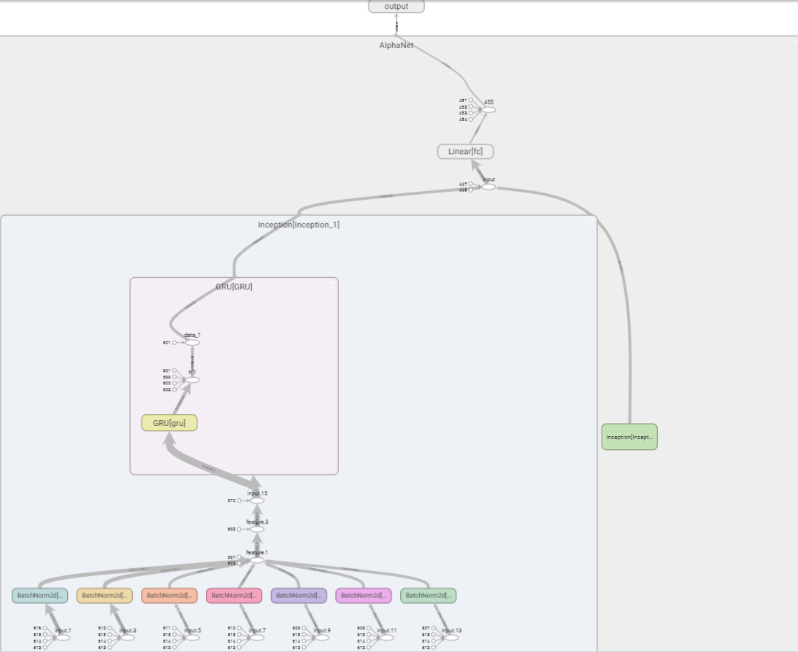
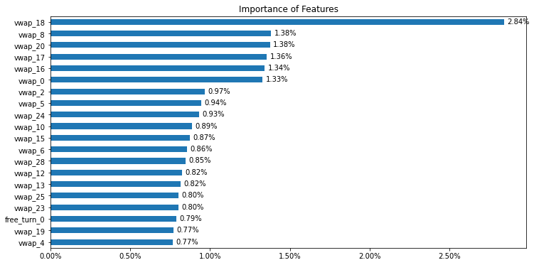

## 思路框架

### 问题背景

传统的因子挖掘过程通常是由人工构造因子表达式，对多个单因子进行加权合成。面对大量的原始数据，人工基于投资经验，手动构造因子表达式生成单因子的过程是极其繁琐的。在因子合成阶段，通常是用ICIR加权平均等手段进行合成，这种简单的线性加权方式也限制了因子合成的多种可能性。

### 将卷积思想应用于因子挖掘

在卷积神经网络中，最关键的特征提取组件是卷积核。在图像识别领域，卷积核通过一个带有可优化的权重和偏置项的矩阵，对原始数据进行互相关操作。


我们可以将原始量价数据整理成一个二维矩阵，尝试使用卷积核对数据进行特征提取。

但是，如果完全采用传统的卷积操作，提取的特征就是：一定感受野范围内的特征的加权组合。这样的操作会有两个问题：

1. 提取的特征只是某些特征数据的固定的加权组合，这极大地限制了因子表达式的可能性。
2. 传统的卷积核只能感受局部范围内的数据，因此，我们输入的特征变量的上下顺序会影响提取出的特征。因此输入变量的顺序还需要人工干预。

由此看来，简单地套用卷积操作并不合适，但我们可以借鉴卷积核的“遍历操作”的思想，自定义运算符函数，实现类似“卷积层”的特征提取层。


具体的特征提取层将在后文介绍。经过特征提取后，可再添加批标准化层、池化层、全连接层，将原始数据转换为收益率的预测。

### 优化模型

对于上述将卷积思想应用于因子挖掘的方法，可以尝试对两个方向进行优化。

1. 调整网络结构。添加更丰富的特征提取层，将池化层转换为可以记忆时序信息的循环神经网络。
2. 调整标签值。将收益率值得预测转换为涨跌方向的预测和超额收益率方向的预测。

## 准备数据集

我们需要的特征均为量价数据，即open, high, low, close, vwap, volume, return1, turn, free_turn这9个量价指标在$t-29$到$t$时间段的$9\times 30$个特征。


Tushare提供了免费的量价数据接口，在程序中导入token，即可使用`pro.daily()`下载数据。

下面具体介绍获取数据的细节。

### 训练集和测试集包含的时间段

由于通过Tushare的免费接口获取数据的速度较慢（逐股票、逐日获取后再合并，而不是批量一次性获取，因此耗时较久），本文只截取了`20220101`至`20220630`这半年的数据作为训练集，`20220930`至`20221231`这一季度的数据作为测试集。没有用`20220630`至`20221231`的数据作为测试集，是因为希望训练集和验证集之间能够暂停一段时间，否则训练集的标签可能会包含未来信息，进而夸大测试集上的预测效果。

> 本项目下载数据的时间为2022年12月初，因此实际所用的验证集并不是完整的一季度。

### 采样的日期

如果对训练集和验证集包含的时间段中的**每一个交易日**均进行采样，会造成两个问题：

1. 采样过于频繁，导致相邻日期的数据基本相近。
2. 采样天数过多，下载数据的时间会非常久。

因此，本文使用间隔采样的方法，**每间隔10个交易日进行一次采样**。具体判断哪一天为采样日的函数为：

```python
# 给定日期区间的端点，输出期间的定长采样交易日列表
def get_datelist(start: str, end: str, interval: int):

    df = pro.index_daily(ts_code='399300.SZ', start_date=start, end_date=end)
    date_list = list(df.iloc[::-1]['trade_date'])
    sample_list = []
    for i in range(len(date_list)):
        if i % interval == 0:
            sample_list.append(date_list[i])

    return sample_list
```

其原理是基于沪深300指数（399300.SZ）的交易数据进行间隔采样。沪深300指数有数据的日期一定是交易日。

### 采样的股票

A股市场的股票数量近5000只，若对每一只股票均进行采样也将耗费大量时间。本文对每个采样日，**获取前1000只股票的数据**。具体判断对哪些股票进行采样的函数为：

```python
# 给定一个交易日，返回该日满足条件的A股股票列表
def get_stocklist(date: str, num: int):

    start = str(pd.to_datetime(date)-timedelta(30))
    start = start[0:4]+start[5:7]+start[8:10]
    df1 = pro.index_weight(index_code='000002.SH',
                           start_date=start, end_date=date)  # 交易日当天的股票列表
    codes = list(df1['con_code'])
    codes = codes[0:1000]  # 在每个截面期只选取1000只股票

    return codes
```

其原理是基于A股指数（000002.SH）的前1000只成分股进行采样。

### 获取单个股票在单个交易日的数据

`get_x_y()`函数返回两个值，一个是前30个交易日的9个指标面板（9*30），一个是未来10天的收益率。

```python
def get_x_y(code: str, date: str, pass_day: int, future_day: int, len1: int, len2: int):

    start = str(pd.to_datetime(date)-timedelta(pass_day*2))
    start = start[0:4]+start[5:7]+start[8:10]
    end = str(pd.to_datetime(date)+timedelta(future_day*2))
    end = end[0:4]+end[5:7]+end[8:10]
    df_price = pro.daily(ts_code=code,  # OHLC,pct_change,volume
                         start_date=start, end_date=date)
    df_basic = pro.daily_basic(ts_code=code,
                               start_date=start, end_date=date)
    df_return = pro.daily(ts_code=code,
                          start_date=date, end_date=end).iloc[::-1]['close']
    if (df_price.shape[0] == df_basic.shape[0]) & (df_price.shape[0] == len1) & (df_return.shape[0] == len2):  # 判断数据的完整性
        df_price = df_price.iloc[0:pass_day, [2, 3, 4, 5, 8, 9]].fillna(0.1)
        df_basic = df_basic.iloc[0:pass_day, [3, 4, 5]].fillna(0.1)
        data = np.array(pd.merge(df_price, df_basic,
                        left_index=True, right_index=True).iloc[::-1].T)
        # print(data.shape)
        # 未来十个交易日的收益率
        dfr = df_return.iloc[0:future_day]
        ret = dfr.iloc[-1]/dfr.iloc[0]-1  # 后十个交易日的收益率
        return data, ret
    else:
        return None, None  # 数据缺失的预处理
```

### 舍弃缺失值

在获取单个股票在单个交易日的数据时，若某只股票的数据有缺失，则需舍弃它，否则在输入到神经网络时会带有缺失值。

基于沪深300指数，判断某日应有的数据长度的函数：

```python
def get_length(date: str, pass_day: int, future_day: int):
    start = str(pd.to_datetime(date)-timedelta(pass_day*2))
    start = start[0:4]+start[5:7]+start[8:10]
    end = str(pd.to_datetime(date)+timedelta(future_day*2))
    end = end[0:4]+end[5:7]+end[8:10]
    len_1 = pro.index_daily(ts_code='399300.SZ',
                            start_date=start, end_date=date).shape[0]
    len_2 = pro.index_daily(ts_code='399300.SZ',
                            start_date=date, end_date=end).shape[0]
    return len_1, len_2
```

在`get_x_y()`函数中，基于`len_1`和`len_2`判断了数据的完整性。若有缺失值则返回空值，不会计入数据集中。

### 获取数据集

筛选出哪一天、哪一只股票需要进行采样后，我们就可以获取数据了。

对每一个采样日、每一只股票进行循环。配合`rich.progress`可以展示下载数据的进度条。

> `rich.progress`的使用示例可以参考[这里](https://fengchao.pro/pin/frequently-used-python-data-processing-code/#richprogress%E5%B1%95%E7%A4%BA%E8%BF%9B%E5%BA%A6%E6%9D%A1)。

```python
def get_dataset(num: int, start: str, end: str, interval: int, pass_day: int, future_day: int):
    X_train = []
    y_train = []
    trade_date_list = get_datelist(start, end, interval)
    # 添加进度条
    with Progress() as progress:
        task_date = progress.add_task(
            "[red]Date...", total=len(trade_date_list))
        for date in trade_date_list:
            # 更新进度条
            progress.update(task_date, advance=1)
            stock_list = get_stocklist(date, num)
            len1, len2 = get_length(date, pass_day, future_day)
            task_stock = progress.add_task(
                "[green]Stock...", total=len(range(len(stock_list))))
            for i in range(len(stock_list)):
                # 更新进度条
                progress.update(task_stock, advance=1)
                code = stock_list[i]
                x, y = get_x_y(code, date, pass_day, future_day, len1, len2)
                try:
                    if (x.shape[0] == 9) & (x.shape[1] == pass_day):
                        X_train.append(x)
                        y_train.append(y)
                except Exception:
                    continue
    return X_train, y_train
```

数据示例：


### 保存`.npy`数据到本地

为了方便训练模型，可以将数据以`.npy`格式存储到本地。在训练模型时可以直接使用`np.load('../data/X_train.npy')`载入数据。

```python
# 参数设定：使用过去30天的数据预测未来10天的收益率，回归问题
X_train, y_train = get_dataset(
    num=1000, start='20220101', end='20220630', interval=10, pass_day=30, future_day=10)
X_test, y_test = get_dataset(num=1000, start='20220931',
                             end='20221231', interval=10, pass_day=30, future_day=10)
print("there are in total", len(X_train), "training samples")
print("there are in total", len(X_test), "testing samples")
# 将数据保存到本地供离线训练
Xa = np.array(X_train)
ya = np.array(y_train)
Xe = np.array(X_test)
ye = np.array(y_test)
np.save('./X_train.npy', Xa)
np.save('./y_train.npy', ya)
np.save('./X_test.npy', Xe)
np.save('./y_test.npy', ye)
```

整个获取数据的时间约为3个小时，共获取到11825条训练数据和4943条测试数据（数据量不为1000的整数倍，是因为舍弃了部分缺失值）。

- 特征数据为$9\times 30$的个股量价数据构成的矩阵。9行代表9个量价特征，30代表$t-29$至$t$这30天的数据。

- 标签数据为个股在某个交易日往后10个交易日的收益率。


## 搭建AlphaNet-V1

### AlphaNet-V1的整体网络结构

下图展示了AlphaNet-V1的整体网络结构。它由7个平行的特征提取层、3个平行的池化层和1个全连接层组成。其中，特征提取层和池化层后都有一个批标准化层（Batch Normalization）。

输入数据是一个$9\times30$的个股量价“数据图片”，预测目标为个股从当日到10个交易日后的收益率数值。


### 特征提取层（类似卷积层）

AlphaNet的输入数据是一个$9\times30$的个股量价“数据图片”。如果简单地套用卷积神经网络处理图片像素数据的操作，则**卷积操作只能在感受野内将若干日期的若干量价数据进行加权平均**，经过卷积层得到的特征将变得很难解释，也不符合传统构造量价因子的方式。

因此，借鉴卷积神经网络CNN的思想，我们可以将**多种运算符函数作为自定义网络层**进行特征提取。本文实现了7种运算符，分别是`ts_corr`, `ts_cov`, `ts_stddev`, `ts_zscore`, `ts_return`, `ts_decaylinear`, `ts_mean`，它们的含义如下：

| 名称             | 定义                                                         |
| ---------------- | ------------------------------------------------------------ |
| `ts_corr`        | 过去 d 天 X 值构成的时序数列和 Y 值构成的时序数列的相关系数。 |
| `ts_cov`         | 过去 d 天 X 值构成的时序数列和 Y 值构成的时序数列的协方差。  |
| `ts_stddev`      | 过去 d 天 X 值构成的时序数列的标准差。                       |
| `ts_zscore`      | 过去 d 天 X 值构成的时序数列的平均值除以标准差。             |
| `ts_return`      | (X - delay(X, d))/delay(X, d)-1, delay(X, d)为 X 在 d 天前的取值。 |
| `ts_decaylinear` | 过去 d 天 X 值构成的时序数列的加权平均值，权数为 d, d – 1, …, 1(权数之和应为 1，需进行归一化处理)，其中离现在越近的日子权数越大。 |
| `ts_mean`        | 过去 d 天 X 值构成的时序数列的平均值。                       |

这7个运算符函数中，`ts_corr`和`ts_cov`需要从9行数据中提取2行数据，并计算相关系数和协方差。其他5个运算符函数仅需针对某一行数据计算标准差、变化率等。下面针对这两种情况分别举例说明。

#### 基于双变量的特征提取层——以`ts_corr`为例

我们的输入数据是$9\times30$的矩阵，每一行是某个量价指标在最近30个交易日的值。基于双变量进行特征提取的步骤为：

1. 取出两行数据。
2. 对于取出的两行数据，给定步长`stride`，在时间维度上对两行数据进行遍历，计算两行数据的相关系数。例如，当$stride=3$时，下一次计算将在时间维度上往右步进3步，我们将进行$\frac{30}{3}=10$次运算。
3. 将运算结果整理到新的矩阵，得到新的“特征图片”，作为后续池化层的输入。


>  从9行数据中任取2行，有$\tbinom{9}{2}=36$种取法。假设我们设定步长为10，则得到的新的“特征图片”的维数是$36\times3$。

#### 基于双变量的特征提取层——代码实现

需要给定原始矩阵`Matrix`、两两组合的列表`combination`、反转的两两组合的列表`combination_rev`以及每次遍历运算的起始索引列表`index_list`。

- 生成`combination`和`combination_rev`的代码为：

```python
# 生成卷积操作时需要的两列数据的组合的列表
def generate_combination(N):
    """
    args:
        N: int, the number of rows of the matrix

    return:
        combination: list, the combination of two columns of the matrix
        combination_rev: list, the combination of two rows of the matrix, which is the reverse of combination
    """
    col = []
    col_rev = []
    for i in range(1,N):
        for j in range(0,i):
            col.append([i,j])
            col_rev.append([j,i])
    return col, col_rev
# 生成卷积操作时需要的两列数据的组合的列表
combination, combination_rev = generate_combination(9)
```


- 生成`index_list`的代码为：

```python
# 根据输入的矩阵和卷积操作的步长, 计算卷积操作的索引
def get_index_list(matrix, stride):
    """
    args:
        matrix: torch.tensor, the input matrix
        stride: int, the stride of the convolution operation
    
    return:
        index_list: list, the index of the convolution operation

    """
    W = matrix.shape[3]
    if W % stride == 0:
        index_list = list(np.arange(0, W+stride, stride))
    else:
        mod = W % stride
        index_list = list(np.arange(0, W+stride-mod, stride)) + [W]
    return index_list
# 根据输入的矩阵和卷积操作的步长, 计算卷积操作的索引
# Inception模块使用的卷积操作的步长为10
index_list = get_index_list(np.zeros((1,1,9,30)), 10)
```


- 基于双变量的特征提取代码为：

```python
# 过去 d 天 X 值构成的时序数列和 Y 值构成的时序数列的相关系数
def ts_corr4d(self, Matrix, combination, combination_rev):
    new_H = len(combination)
    index_list = self.index_list
    list = []  # 存放长度为len(index_list)-1的相关系数
    for i in range(len(index_list)-1):
        start_index = index_list[i]
        end_index = index_list[i+1]
        data = Matrix[:, :, combination, start_index:end_index]  # N*1*new_H*2*d
        data2 = Matrix[:, :, combination_rev,
                        start_index:end_index]  # N*1*new_H*2*d
        std1 = data.std(axis=4, keepdims=True)  # N*1*new_H*2*1, 在时序上求标准差
        std2 = data2.std(axis=4, keepdims=True)  # N*1*new_H*2*1, 在时序上求标准差
        std = (std1*std2).mean(axis=3, keepdims=True)  # N*1*new_H*1*1
        list.append(std)
    std = np.squeeze(np.array(list)).transpose(1, 2, 0).reshape(-1, 1, new_H, len(index_list)-1)+0.01  # N*1*new_H*len(index_list)-1 # 加上0.01, 防止除0
    # N*1*new_H*len(index_list)-1
    cov = self.ts_cov4d(Matrix, combination, combination_rev)
    corr = cov/std  # N*1*new_H*len(index_list)-1
    return corr
```

```python
# 过去 d 天 X 值构成的时序数列和 Y 值构成的时序数列的协方差
def ts_cov4d(self, Matrix, combination, combination_rev):
    new_H = len(combination)
    index_list = self.index_list
    list = []  # 存放长度为len(index_list)-1的协方差
    for i in range(len(index_list)-1):
        start_index = index_list[i]
        end_index = index_list[i+1]
        data = Matrix[:, :, combination, start_index:end_index]  # N*1*new_H*2*d
        data2 = Matrix[:, :, combination_rev,
                        start_index:end_index]  # N*1*new_H*2*d
        mean1 = data.mean(axis=4, keepdims=True)  # N*1*new_H*2*1, 在时序上求均值
        mean2 = data2.mean(axis=4, keepdims=True)  # N*1*new_H*2*1, 在时序上求均值
        spread1 = data - mean1  # N*1*new_H*2*d, 在时序上求偏差
        spread2 = data2 - mean2  # N*1*new_H*2*d, 在时序上求偏差
        cov = ((spread1 * spread2).sum(axis=4, keepdims=True) /
                (data.shape[4]-1)).mean(axis=3, keepdims=True)  # N*1*new_H*1*1
        list.append(cov)
    cov = np.squeeze(np.array(list)).transpose(
        1, 2, 0).reshape(-1, 1, new_H, len(index_list)-1)  # N*1*new_H*len(index_list)-1
    return torch.from_numpy(cov)
```

经过上述特征提取后，得到的新的“特征图片”的维数是$36\times3$。我们后续会将其进行池化和展平。注意到，这36行数据的上下位置不影响池化和展平操作得到的结果（展平后每个量的地位都一样），因此原始输入数据的$9\times30$的矩阵内部的上下**可以任意排列**。这也避免了卷积神经网络处理图片像素数据时**只能感知局部数据**的问题。

#### 基于单变量的特征提取层——以`ts_stddev`为例

基于单变量进行特征提取的步骤为：

1. 取出一行数据。
2. 对于取出的一行数据，给定步长`stride`，在时间维度上对这一行数据进行遍历，计算这一行数据的标准差。例如，当$stride=3$时，下一次计算将在时间维度上往右步进3步，我们将进行$\frac{30}{3}=10$次运算。
3. 将运算结果整理到新的矩阵，得到新的“特征图片”，作为后续池化层的输入。


> 从9行数据中任取1行，有$\tbinom{9}{1}=9$种取法。假设我们设定步长为10，则得到的新的“特征图片”的维数是9*3。

#### 基于单变量的特征提取层——代码实现

单变量的特征提取只需给定原始数据`Matrix`和每次遍历运算的起始索引列表`index_list`。

```python
# 过去 d 天 X 值构成的时序数列的标准差
def ts_stddev4d(self, Matrix):
    # 只需要对单变量做卷积操作, 不需要将变量两两组合。因此输出的 H 可以保持和输入的 H 一致
    new_H = Matrix.shape[2]
    index_list = self.index_list
    list = []  # 存放长度为len(index_list)-1的标准差
    for i in range(len(index_list)-1):
        start_index = index_list[i]
        end_index = index_list[i+1]
        data = Matrix[:, :, :, start_index:end_index]  # N*1*H*d
        std = data.std(axis=3, keepdims=True)  # N*1*H*1
        list.append(std)
    std4d = np.squeeze(np.array(list)).transpose(
        1, 2, 0).reshape(-1, 1, new_H, len(index_list)-1)  # N*1*new_H*len(index_list)-1
    return torch.from_numpy(std4d)

# 过去 d 天 X 值构成的时序数列的平均值除以标准差
def ts_zcore4d(self, Matrix):
    # 只需要对单变量做卷积操作, 不需要将变量两两组合。因此输出的 H 可以保持和输入的 H 一致
    new_H = Matrix.shape[2]
    index_list = self.index_list
    list = []  # 存放长度为len(index_list)-1的zcore
    for i in range(len(index_list)-1):
        start_index = index_list[i]
        end_index = index_list[i+1]
        data = Matrix[:, :, :, start_index:end_index]  # N*1*H*d
        mean = data.mean(axis=3, keepdims=True)  # N*1*H*1
        std = data.std(axis=3, keepdims=True) + \
            0.01  # N*1*H*1, 加上0.01, 防止除以0
        list.append(mean/std)
    zscore = np.squeeze(np.array(list)).transpose(
        1, 2, 0).reshape(-1, 1, new_H, len(index_list)-1)  # N*1*new_H*len(index_list)-1
    return torch.from_numpy(zscore)

# (X - delay(X, d))/delay(X, d)-1, 其中 delay(X, d)为 X 在 d 天前的取值
def ts_return4d(self, Matrix):
    # 只需要对单变量做卷积操作, 不需要将变量两两组合。因此输出的 H 可以保持和输入的 H 一致
    new_H = Matrix.shape[2]
    index_list = self.index_list
    list = []  # 存放长度为len(index_list)-1的return
    for i in range(len(index_list)-1):
        start_index = index_list[i]
        end_index = index_list[i+1]
        data = Matrix[:, :, :, start_index:end_index]  # N*1*H*d
        # N*1*H*1, 在分母加上0.01, 防止除以0
        return_ = data[:, :, :, -1]/(data[:, :, :, 0]+0.01)-1
        list.append(return_)
    ts_return = np.squeeze(np.array(list)).transpose(
        1, 2, 0).reshape(-1, 1, new_H, len(index_list)-1)  # N*1*new_H*len(index_list)-1
    return torch.from_numpy(ts_return)

# 过去 d 天 X 值构成的时序数列的加权平均值, 权数为 d, d – 1, …, 1(权数之和应为 1, 需进行归一化处理), 其中离现在越近的日子权数越大
def ts_decaylinear4d(self, Matrix):
    new_H = Matrix.shape[2]
    index_list = self.index_list
    list = []  # 存放长度为len(index_list)-1的加权平均值
    for i in range(len(index_list)-1):
        start_index = index_list[i]
        end_index = index_list[i+1]
        range_ = end_index-start_index
        weight = np.arange(1, range_+1)
        weight = weight/weight.sum()  # 权重向量
        data = Matrix[:, :, :, start_index:end_index]  # N*1*H*d
        wd = (data*weight).sum(axis=3, keepdims=True)  # N*1*H*1
        list.append(wd)
    ts_decaylinear = np.squeeze(np.array(list)).transpose(
        1, 2, 0).reshape(-1, 1, new_H, len(index_list)-1)  # N*1*new_H*len(index_list)-1
    return torch.from_numpy(ts_decaylinear)

# 过去 d 天 X 值构成的时序数列的平均值
def ts_mean4d(self, Matrix):
    new_H = Matrix.shape[2]
    index_list = self.index_list
    list = []  # 存放长度为len(index_list)-1的平均值
    for i in range(len(index_list)-1):
        start_index = index_list[i]
        end_index = index_list[i+1]
        data = Matrix[:, :, :, start_index:end_index]  # N*1*H*d
        mean_ = data.mean(axis=3, keepdims=True)  # N*1*H*1
        list.append(mean_)
    ts_mean = np.squeeze(np.array(list)).transpose(
        1, 2, 0).reshape(-1, 1, new_H, len(index_list)-1)  # N*1*new_H*len(index_list)-1
    return torch.from_numpy(ts_mean)
```

上述7个函数就相当于定义好了卷积操作的“卷积核”，并且这些操作中**没有需要优化的参数**，只需要按照给定的运算符进行前向传播。

图像识别领域中的卷积操作是需要优化卷积核的，这也是和图像识别领域中的卷积操作有区别的地方。

### 批标准化层（Batch Normalization）

Batch Normalization通过将每一层的原始输出进行标准化（减去均值，除以标准差），还可以乘以$\gamma$（Scale），再加上$\beta$（Offset）。$\gamma$和$\beta$都是超参数，可以用神经网络训练它们。

具体的数学公式如下。

求第$l$层的批均值：
$$
\mu=\frac{1}{m} \sum_{i=1}^m Z^{l(i)}
$$
求第$l$层的批方差：
$$
\sigma^2=\frac{1}{m} \sum_{i=1}^m\left(Z^{l(i)}-\mu\right)^2
$$
批标准化的结果：
$$
\hat{Z}^l=\gamma * \frac{Z^l-\mu}{\sqrt{\sigma^2+\varepsilon}}+\beta
$$
经过上述操作，即可将$Z^l$转换为$\hat{Z}^l$。

在批标准化中，可优化的参数是$\gamma$和$\beta$。如果没有$\gamma$和$\beta$，则批标准化的运算就为常规的 z-score 标准化。

> 关于Batch Normalization的笔记可以参考[https://fengchao.pro/post/batch-normalization/](https://fengchao.pro/post/batch-normalization/)

### 池化层

在AlphaNet-V1中，池化层与传统的图像识别中的池化层一致，都是对某个区域的数据提取最大值、平均值和最小值。

由于PyTorch中没有内置最小池化层，我们可以将数据取相反数后，进行最大池化，再将最大池化的结果取相反数，就可以实现最小池化。

```python
# 池化层, 尺度为1*d
self.max_pool = nn.MaxPool2d(kernel_size=(1, self.d))
self.avg_pool = nn.AvgPool2d(kernel_size=(1, self.d))
# 最小池化等价于相反数的最大池化, 后续会对结果取反
self.min_pool = nn.MaxPool2d(kernel_size=(1, self.d))
```

### 特征提取层和池化层的特征维数变化分析

在经过特征提取层、池化层后（批标准化层不改变特征维数，因此不考虑），将特征提取层和池化层的输出均展平后再拼接，得到$702\times1$的特征。

下面解释维数为$702\times 1$是如何得到的。

1. 特征提取层展平后得到$351\times1$的特征。

- 有2个特征提取层是基于双变量的，它们的输出维数是$36\times3$。其他5个特征提取层都是基于单变量的，它们的输出维数是$9\times3$。

- 因此，特征提取层展平后得到$(2\times36+5\times9)\times3=117\times3=351$维特征。

2. 池化层展平后也会得到$351\times1$的特征。

- 池化层的输入就是特征提取层的输出，因此池化层的输入是$117\times3$。
- 池化操作的步长`stride`是`len(index_list)-1`$=3$，即最大池化、平均池化和最小池化都将$117\times3$转换为$117\times1$的矩阵。
- 将3个$117\times1$的矩阵展平后，得到$3*117=351$维特征。

3. 将特征提取层和池化层的输出均展平后再拼接，得到$351+351=702$维特征。

### 全连接层

全连接层包含30个神经元，接受输入为$702\times 1$的矩阵，经过一个隐藏层转换为$30\times1$的矩阵，经过RELU激活函数、Dropout Rate为0.5，再输出到$1*1$的神经元作为预测结果。

```python
data = self.fc1(data) # N*30
data = self.relu(data)
data = self.dropout(data)
data = self.fc2(data) # N*1
# 线性激活函数, 无需再进行激活
data = data.to(torch.float)
```

### 继承`nn.module`类，改写前向传播`forward`函数

为了让我们自定义的函数在神经网络中能够运行，我们需要继承`nn.module`类并改写前向传播`forward`函数。

#### 自定义特征提取层、池化层的代码实现

自定义的`Inception`类实现了特征提取层（以及随后的批标准化）、池化层（以及随后的批标准化），并将输出结果展平成$702\times 1$的矩阵。

具体的运算符函数在前面已经定义过了，这里不再详细展开。

```python
class Inception(nn.Module):
    """
    Inception, 用于提取时间序列的特征, 具体操作包括：

    1. kernel_size和stride均为d=10的特征提取层, 类似于卷积层，用于提取时间序列的特征. 具体包括:

        1. ts_corr4d: 过去 d 天 X 值构成的时序数列和 Y 值构成的时序数列的相关系数
        2. ts_cov4d: 过去 d 天 X 值构成的时序数列和 Y 值构成的时序数列的协方差
        3. ts_stddev4d: 过去 d 天 X 值构成的时序数列的标准差
        4. ts_zscore4d: 过去 d 天 X 值构成的时序数列的平均值除以标准差
        5. ts_return4d: (X - delay(X, d))/delay(X, d)-1, 其中delay(X, d)为 X 在 d 天前的取值
        6. ts_decaylinear4d: 过去 d 天 X 值构成的时序数列的加权平均值，权数为 d, d – 1, …, 1(权数之和应为 1，需进行归一化处理)，其中离现在越近的日子权数越大
        7. ts_mean4d: 过去 d 天 X 值构成的时序数列的平均值

        各操作得到的张量维数：
        1. 由于涉及两个变量的协方差, 因此ts_corr4d和ts_cov4d的输出为 N*1*36*3
        2. 其余操作均只涉及单变量的时序计算, 因此输出为 N*1*9*3

    2. 对第1步的输出进行Batch Normalization操作, 输出维数仍为 N*1*36*3 或 N*1*9*3

    3. 对于第2步得到的张量, kernel_size为3的池化层. 具体包括:
        1. max_pool: 过去 d 天 X 值构成的时序数列的最大值
        2. avg_pool: 过去 d 天 X 值构成的时序数列的平均值
        3. min_pool: 过去 d 天 X 值构成的时序数列的最小值

        以上三个操作的输出均为 N*1*117*1
    
    4. 对第3步的输出进行Batch Normalization操作, 输出维数仍为 N*1*117*1

    5. 将第2步和第4步的输出展平后进行拼接, 得到的张量维数为 N*(2*36*3+5*9*3+3*117) = N*702

    """

    def __init__(self, combination, combination_rev, index_list):
        """
        combination: 卷积操作时需要的两列数据的组合
        combination_rev: 卷积操作时需要的两列数据的组合, 与combination相反
        index_list: 卷积操作时需要的时间索引
        
        """

        super(Inception, self).__init__()
        # 卷积操作时需要的两列数据的组合
        self.combination = combination
        self.combination_rev = combination_rev

        # 卷积操作时需要的时间索引
        self.index_list = index_list
        self.d = len(index_list)-1

        # 卷积操作后的Batch Normalization层
        self.bc1 = nn.BatchNorm2d(1)
        self.bc2 = nn.BatchNorm2d(1)
        self.bc3 = nn.BatchNorm2d(1)
        self.bc4 = nn.BatchNorm2d(1)
        self.bc5 = nn.BatchNorm2d(1)
        self.bc6 = nn.BatchNorm2d(1)
        self.bc7 = nn.BatchNorm2d(1)

        # 池化层, 尺度为1*d
        self.max_pool = nn.MaxPool2d(kernel_size=(1, self.d))
        self.avg_pool = nn.AvgPool2d(kernel_size=(1, self.d))
        # 最小池化等价于相反数的最大池化, 后续会对结果取反
        self.min_pool = nn.MaxPool2d(kernel_size=(1, self.d))

        # 池化操作后的Batch Normalization层
        self.bc_pool1 = nn.BatchNorm2d(1)
        self.bc_pool2 = nn.BatchNorm2d(1)
        self.bc_pool3 = nn.BatchNorm2d(1)

    def forward(self, data):
        """
        data: 输入的数据, 维度为batch_size*1*9*30

        """
        # 本层的输入为batch_size*1*9*30, 在训练时不需要反向传播, 因此可以使用detach()函数
        data = data.detach().cpu().numpy()
        combination = self.combination
        combination_rev = self.combination_rev

        # 卷积操作
        conv1 = self.ts_corr4d(data, combination, combination_rev).to(torch.float)
        conv2 = self.ts_cov4d(data, combination, combination_rev).to(torch.float)
        conv3 = self.ts_stddev4d(data).to(torch.float)
        conv4 = self.ts_zcore4d(data).to(torch.float)
        conv5 = self.ts_return4d(data).to(torch.float)
        conv6 = self.ts_decaylinear4d(data).to(torch.float)
        conv7 = self.ts_mean4d(data).to(torch.float)

        # 卷积操作后的Batch Normalization
        batch1 = self.bc1(conv1)
        batch2 = self.bc2(conv2)
        batch3 = self.bc3(conv3)
        batch4 = self.bc4(conv4)
        batch5 = self.bc5(conv5)
        batch6 = self.bc6(conv6)
        batch7 = self.bc7(conv7)

        # 在 H 维度上进行特征拼接
        feature = torch.cat(
            [batch1, batch2, batch3, batch4, batch5, batch6, batch7], axis=2)  # N*1*(2*36+5*9)*3 = N*1*117*3

        # 同时将特征展平, 准备输入到全连接层
        feature_flatten = feature.flatten(start_dim=1)  # N*(117*3) = N*351

        # 对多通道特征进行池化操作, 每层池化后面都有Batch Normalization
        # 最大池化
        maxpool = self.max_pool(feature)  # N*1*117*1
        maxpool = self.bc_pool1(maxpool)
        # 平均池化
        avgpool = self.avg_pool(feature)  # N*1*117*1
        avgpool = self.bc_pool2(avgpool)
        # 最小池化
        # N*1*117*1, 最小池化等价于相反数的最大池化, 并对结果取反
        minpool = -self.min_pool(-1*feature)
        minpool = self.bc_pool3(minpool)
        # 特征拼接
        pool_cat = torch.cat([maxpool, avgpool, minpool],
                             axis=2)  # N*1*(3*117)*1 = N*1*351*1
        # 将池化层的特征展平
        pool_cat_flatten = pool_cat.flatten(start_dim=1)  # N*351

        # 拼接展平后的特征
        feature_final = torch.cat(
            [feature_flatten, pool_cat_flatten], axis=1)  # N*(351+351) = N*702
        return feature_final

    # 过去 d 天 X 值构成的时序数列和 Y 值构成的时序数列的相关系数
    def ts_corr4d(self, Matrix, combination, combination_rev):
        ...

    # 过去 d 天 X 值构成的时序数列和 Y 值构成的时序数列的协方差
    def ts_cov4d(self, Matrix, combination, combination_rev):
        ...

    # 过去 d 天 X 值构成的时序数列的标准差
    def ts_stddev4d(self, Matrix):
        ...

    # 过去 d 天 X 值构成的时序数列的平均值除以标准差
    def ts_zcore4d(self, Matrix):
        ...

    # (X - delay(X, d))/delay(X, d)-1, 其中 delay(X, d)为 X 在 d 天前的取值
    def ts_return4d(self, Matrix):
        ...

    # 过去 d 天 X 值构成的时序数列的加权平均值, 权数为 d, d – 1, …, 1(权数之和应为 1, 需进行归一化处理), 其中离现在越近的日子权数越大
    def ts_decaylinear4d(self, Matrix):
        ...

    # 过去 d 天 X 值构成的时序数列的平均值
    def ts_mean4d(self, Matrix):
        ...
```

#### 自定义AlphaNet的代码实现

整合前面的各层，封装到AlphaNet中。

```python
class AlphaNet(nn.Module):

    def __init__(self, combination, combination_rev, index_list, fc1_num, fc2_num, dropout_rate):
        super(AlphaNet, self).__init__()
        self.combination = combination
        self.combination_rev = combination_rev
        self.fc1_num = fc1_num
        self.fc2_num = fc2_num
        # 自定义的Inception模块
        self.Inception = Inception(combination, combination_rev, index_list)
        # 两个全连接层
        self.fc1 = nn.Linear(fc1_num, fc2_num) # 702 -> 30
        self.fc2 = nn.Linear(fc2_num, 1) # 30 -> 1
        # 激活函数
        self.relu = nn.ReLU()
        # dropout
        self.dropout = nn.Dropout(dropout_rate)
        # 初始化权重
        self._init_weights()

    def _init_weights(self):
        # 使用xavier的均匀分布对weights进行初始化
        nn.init.xavier_uniform_(self.fc1.weight)
        nn.init.xavier_uniform_(self.fc2.weight)
        # 使用正态分布对bias进行初始化
        nn.init.normal_(self.fc1.bias, std=1e-6)
        nn.init.normal_(self.fc2.bias, std=1e-6)

    def forward(self, data):
        data = self.Inception(data)  # N*702
        data = self.fc1(data) # N*30
        data = self.relu(data)
        data = self.dropout(data)
        data = self.fc2(data) # N*1
        # 线性激活函数, 无需再进行激活
        data = data.to(torch.float)

        return data
```

### 使用`torchsummary`包查看网络结构

```python
from torchsummary import summary

test = AlphaNet(combination, combination_rev, index_list, fc1_num=702, fc2_num=30, dropout_rate=0.5)

summary(test, input_size=(1, 9, 30))
```

```
----------------------------------------------------------------
        Layer (type)               Output Shape         Param #
================================================================
       BatchNorm2d-1             [-1, 1, 36, 3]               2
       BatchNorm2d-2             [-1, 1, 36, 3]               2
       BatchNorm2d-3              [-1, 1, 9, 3]               2
       BatchNorm2d-4              [-1, 1, 9, 3]               2
       BatchNorm2d-5              [-1, 1, 9, 3]               2
       BatchNorm2d-6              [-1, 1, 9, 3]               2
       BatchNorm2d-7              [-1, 1, 9, 3]               2
         MaxPool2d-8            [-1, 1, 117, 1]               0
       BatchNorm2d-9            [-1, 1, 117, 1]               2
        AvgPool2d-10            [-1, 1, 117, 1]               0
      BatchNorm2d-11            [-1, 1, 117, 1]               2
        MaxPool2d-12            [-1, 1, 117, 1]               0
      BatchNorm2d-13            [-1, 1, 117, 1]               2
        Inception-14                  [-1, 702]               0
           Linear-15                   [-1, 30]          21,090
             ReLU-16                   [-1, 30]               0
          Dropout-17                   [-1, 30]               0
           Linear-18                    [-1, 1]              31
================================================================
Total params: 21,141
Trainable params: 21,141
Non-trainable params: 0
----------------------------------------------------------------
Input size (MB): 0.00
Forward/backward pass size (MB): 0.01
Params size (MB): 0.08
Estimated Total Size (MB): 0.10
----------------------------------------------------------------
```

自定义的特征提取层不需要训练参数，只需要按照规定的运算函数完成前向传播即可。同样地，池化层也不需要训练参数。

需要训练的参数来自：批标准化的$\gamma$和$\beta$，全连接层的weight和bias。

## 载入数据

### 继承`Dataset`类，改写`__getitem__`

```python
class FactorData(Dataset):

    def __init__(self, train_x, train_y):
        self.len = len(train_x)
        self.x_data = train_x
        self.y_data = train_y

    def __getitem__(self, index):
        """
        指定读取数据的方式: 根据索引index返回dataset[index]

        """
        return self.x_data[index], self.y_data[index]

    def __len__(self):
        return self.len

```

### 设定Batch Size

```python
batch_size = 1000
```

### 将数据载入到DataLoader中

```python
# 将数据载入到DataLoader中
train_data = FactorData(trainx, trainy)
train_loader = DataLoader(dataset=train_data,
                          batch_size=batch_size,
                          shuffle=False)  # 不打乱数据集
test_data = FactorData(testx, testy)
test_loader = DataLoader(dataset=test_data,
                         batch_size=batch_size,
                         shuffle=False)  # 不打乱数据集
```

## 训练和测试模型

### 将AlphaNet实例化

```python
# 构建模型
alphanet = AlphaNet(combination=combination, combination_rev=combination_rev,
                    index_list=index_list, fc1_num=702, fc2_num=30, dropout_rate=0.5)
```

### 设定优化器

```python
weight_list, bias_list = [], []
for name, p in alphanet.named_parameters():
    # 将所有的bias参数放入bias_list中
    if 'bias' in name:
        bias_list += [p]
    # 将所有的weight参数放入weight_list中
    else:
        weight_list += [p]

# weight decay: 对所有weight参数进行L2正则化
optimizer = optim.RMSprop([{'params': weight_list, 'weight_decay': 1e-5},
                           {'params': bias_list, 'weight_decay': 0}],
                          lr=1e-4,
                          momentum=0.9)
```

### 设定损失函数为均方误差MSE

```python
# 损失函数为均方误差 MSE
criterion = nn.MSELoss()
```

### 训练和测试模型

由于AlphaNet-V1的网络结构较为简单，模型在5到10个Epoch的训练后即收敛，因此我们设定训练轮次`epoch_num`为5。

训练和测试模型的代码如下：

```python
epoch_num = 5
train_loss_list = []
test_loss_list = []
best_test_epoch, best_test_loss = 0, np.inf
seed = 0
for epoch in range(1, epoch_num+1):
    train_loss, test_loss = 0, 0
    # 在训练集中训练模型
    alphanet.train()  # 关于.train()的作用，可以参考https://stackoverflow.com/questions/51433378/what-does-model-train-do-in-pytorch
    train_batch_num = 0
    for data, label in tqdm(train_loader, f'Epoch {epoch}-train', leave=False):
        train_batch_num += 1
        # 准备数据
        data, label = data.to(torch.float), label.to(torch.float)
        # 得到训练集的预测值
        out_put = alphanet(data)
        # 计算损失
        loss = criterion(out_put, label)
        # 将损失值加入到本轮训练的损失中
        train_loss += loss.item()
        # 梯度清零
        optimizer.zero_grad() # 关于.zero_grad()的作用，可以参考https://stackoverflow.com/questions/48001598/why-do-we-need-to-call-zero-grad-in-pytorch
        # 反向传播求解梯度
        loss.backward()
        # 更新权重参数
        optimizer.step()

    # 测试模式
    alphanet.eval()
    test_batch_num = 0
    with torch.no_grad():
        for data, label in tqdm(test_loader, f'Epoch {epoch}-test ', leave=False):
            test_batch_num += 1
            data, label = data.to(torch.float), label.to(torch.float)
            # 得到测试集的预测值
            y_pred = alphanet(data)
            # 计算损失
            loss = criterion(y_pred, label)
            # 将损失值加入到本轮测试的损失中
            test_loss += loss.item()

    train_loss_list.append(train_loss/train_batch_num)
    test_loss_list.append(test_loss/test_batch_num)
```

### 绘制训练集和测试集上损失的变化

```python
# 画出损失函数的变化
fig = plt.figure(figsize=(9, 6))
# 字号
plt.rcParams['font.size'] = 16
ax = fig.add_subplot(111)
ax.plot(range(1, epoch_num+1), train_loss_list, 'r', label='train loss')
ax.plot(range(1, epoch_num+1), test_loss_list, 'b', label='test loss')
# 设置x轴刻度为整数
ax.xaxis.set_major_locator(ticker.MultipleLocator(1))
# 设置y轴范围
ax.set_ylim(bottom=0, top=0.1)
ax.legend()
ax.set_xlabel('Epoch')
ax.set_ylabel('MSE Loss')
plt.show()
```


经过测试发现，训练集和验证集在训练5轮左右就已经收敛，损失已不再下降。为了探究模型给出了什么样的预测值，我们接下来比较部分样本标签的预测值和真实值。

### 预测值和真实值的比较

为方便查看，我们截取最后一批训练样本的前200个样本，对比模型的预测标签值和真实标签值。

```python
# 绘制部分预测值和真实值
y_pred = y_pred.detach().numpy()
label = label.detach().numpy()

# 截取部分数据
part = range(0, 200)
plt.plot(y_pred[part], label='pred')
plt.plot(label[part], label='true')
plt.legend()
plt.show()
```


AlphaNet-V1给出的标签预测值几乎都为常数，只在少部分样本点有突出值，这并不是一个理想的收益率预测值。对于标签预测值几乎都为常数的情况，我推测原因可能是：

1. AlphaNet-V1的网络结构较简单，只使用了7个平行的特征提取层、3个平行的池化层和一个全连接层。简单的网络结构限制了参数的选择范围，为了减少损失，模型可能会倾向于选择常数作为标签预测值。
2. AlphaNet-V1用的池化层通过取最大、平均和最小的操作，将3个在时序值转换为1个值。而这三个时序值仍然具有时序信息，但简单的池化层会丧失这一时序信息。

### 保存模型

将模型的结构和参数均保存到本地，方便后续使用。

```python
# 保存模型
torch.save(alphanet, 'alphanet_v1_pool.pth')
```

## 改进方向

在实证检验后，我们发现AlphaNet-V1给出的标签预测值几乎都为常数，只在少部分样本点有突出值，这并不是一个理想的收益率预测值。因此，本文尝试对AlphaNet-V1进行两方面的改进：

1. 调整网络结构。AlphaNet-V1的网络结构较简单，我们将在AlphaNet-V3版本中加入不同步长`stride`的特征提取层，并将现有的池化层转换为可以记忆时序信息的门控循环单元（GRU）。
2. 调整标签值。AlphaNet-V1预测的标签值是个股在未来10个交易日的收益率。我们将在AlphaNet-V3版本中将预测标签转换为涨跌方向（1代表上涨，即收益率大于0；0代表不变或下跌，即收益率小于或等于0）和超额收益方向（1代表收益率大于当批的平均收益率，0代表收益率小于或等于当批的平均收益率）。

## 搭建AlphaNet-V3

### 加入多步长的特征提取层

AlphaNet-V1的特征提取层中，固定步长`stride=10`，我们可以设定其他的步长，拓宽因子挖掘的可能性。

下面我们加入步长`stride=3`的特征提取层，仍使用AlphaNet-V1中的7个运算符函数。

由于步长发生变化，因此卷积操作的索引列表也发生了变化。我们需要生成两个不同的`index_list`，供两个步长不同的特征提取层使用。

```python
# 根据输入的矩阵和卷积操作的步长, 计算卷积操作的索引
def get_index_list(matrix, stride):
    """
    args:
        matrix: torch.tensor, the input matrix
        stride: int, the stride of the convolution operation
    
    return:
        index_list: list, the index of the convolution operation

    """
    W = matrix.shape[3]
    if W % stride == 0:
        index_list = list(np.arange(0, W+stride, stride))
    else:
        mod = W % stride
        index_list = list(np.arange(0, W+stride-mod, stride)) + [W]
    return index_list
# 根据输入的矩阵和卷积操作的步长, 计算卷积操作的索引
# inception1模块使用的卷积操作的步长为10
index_list_1 = get_index_list(np.zeros((1,1,9,30)), 10)
# inception2模块使用的卷积操作的步长为3
index_list_2 = get_index_list(np.zeros((1,1,9,30)), 3)
```


在AlphaNet-V1中，我们已经编写了`Inception`类，它可以接收不同的`index_list`作为参数，因此我们只需要传入`index_list_2`即可实现步长为`stride=3`的特征提取层。

```python
class AlphaNet(nn.Module):

    def __init__(self, combination, combination_rev, index_list_1, index_list_2, fc_num):
        super(AlphaNet, self).__init__()
        self.combination = combination
        self.combination_rev = combination_rev
        # 自定义的Inception1模块
        self.Inception_1 = Inception(combination, combination_rev, index_list_1)
        # 自定义的Inception2模块
        self.Inception_2 = Inception(combination, combination_rev, index_list_2)
        # 输出层
        self.fc = nn.Linear(fc_num, 1) # 30 -> 1
        # 初始化权重
        self._init_weights()
```

上面的代码完成了两个平行的特征提取层。

### 将池化层替换为门控循环单元（GRU）

AlphaNet-V1中的池化层仅是将特征提取层的输出在时序上取最大、平均和最小池化。若特征提取层中的步长`stride=10`，则池化的作用是将时序上的3个值取最大、平均和最小值，转换为1个值。这样的操作丧失了特征提取层得到的3个值本身的时序信息。


为了保留特征提取层得到的输出本身的时序信息，我们将池化层转换为门控循环单元，它是循环神经网络的一种，可以接受时序输入，并输出带有时序记忆的隐藏状态。

我们自定义的GRU层的代码如下。由于特征提取层将得到维数为$117\times3$或$117\times10$的矩阵，因此我们设定`input_size=117`。`num_layers`设为2。我们需要的输出是带有时序记忆的隐藏状态。最终将得到维数为$30$的矩阵。

```python
class GRU(nn.Module):
    def __init__(self):
        super(GRU, self).__init__()
        self.gru = nn.GRU(input_size=117, hidden_size=30,
                          num_layers=2, batch_first=True, bidirectional=False)

    def forward(self, data):
        # N*time_step*117 -> output: torch.Size([1000, time_step, 30]), hn: torch.Size([2, 1000, 30]), 对于Inception1, time_step=3, 对于Inception2, time_step=10
        output, hn = self.gru(data)
        h = hn[-1:] # 使用最后一层hidden state的输出, h: torch.Size([1, 1000, 30])
        data = h.squeeze(0) # torch.Size([1000, 30])
        return data  # torch.Size([1000, 30])

```

将GRU层嵌入到自定义的`Inception`类中：

```python
class Inception(nn.Module):
    """
    Inception, 用于提取时间序列的特征, 具体操作包括：

    1. kernel_size和stride为d=10或3的特征提取层, 类似于卷积层，用于提取时间序列的特征. 具体包括:(下面以d=10为例)

        1. ts_corr4d: 过去 d 天 X 值构成的时序数列和 Y 值构成的时序数列的相关系数
        2. ts_cov4d: 过去 d 天 X 值构成的时序数列和 Y 值构成的时序数列的协方差
        3. ts_stddev4d: 过去 d 天 X 值构成的时序数列的标准差
        4. ts_zscore4d: 过去 d 天 X 值构成的时序数列的平均值除以标准差
        5. ts_return4d: (X - delay(X, d))/delay(X, d)-1, 其中delay(X, d)为 X 在 d 天前的取值
        6. ts_decaylinear4d: 过去 d 天 X 值构成的时序数列的加权平均值，权数为 d, d – 1, …, 1(权数之和应为 1，需进行归一化处理)，其中离现在越近的日子权数越大
        7. ts_mean4d: 过去 d 天 X 值构成的时序数列的平均值

        各操作得到的张量维数：
        1. 由于涉及两个变量的协方差, 因此ts_corr4d和ts_cov4d的输出为 N*1*36*3
        2. 其余操作均只涉及单变量的时序计算, 因此输出为 N*1*9*3

    2. 对第1步的输出进行Batch Normalization操作, 输出维数仍为 N*1*36*3 或 N*1*9*3

    3. 对第2步的输出, 在 H 维度上拼接, 输出维数为 N*1*(2*36+5*9)*3 = N*1*117*3

    4. 对第3步的输出, 使用GRU进行特征提取, 输出维数为 N*30

    """

    def __init__(self, combination, combination_rev, index_list):
        """
        combination: 卷积操作时需要的两列数据的组合
        combination_rev: 卷积操作时需要的两列数据的组合, 与combination相反
        index_list: 卷积操作时需要的时间索引
        
        """

        super(Inception, self).__init__()
        # 卷积操作时需要的两列数据的组合
        self.combination = combination
        self.combination_rev = combination_rev

        # 卷积操作时需要的时间索引
        self.index_list = index_list

        # 卷积操作后的Batch Normalization层
        self.bc1 = nn.BatchNorm2d(1)
        self.bc2 = nn.BatchNorm2d(1)
        self.bc3 = nn.BatchNorm2d(1)
        self.bc4 = nn.BatchNorm2d(1)
        self.bc5 = nn.BatchNorm2d(1)
        self.bc6 = nn.BatchNorm2d(1)
        self.bc7 = nn.BatchNorm2d(1)

        # GRU层
        self.GRU = GRU()

    def forward(self, data):
        """
        data: 输入的数据, 维度为batch_size*1*9*30

        """
        # 本层的输入为batch_size*1*9*30, 在训练时不需要反向传播, 因此可以使用detach()函数
        data = data.detach().cpu().numpy()
        combination = self.combination
        combination_rev = self.combination_rev

        # 卷积操作
        conv1 = self.ts_corr4d(data, combination, combination_rev).to(torch.float)
        conv2 = self.ts_cov4d(data, combination, combination_rev).to(torch.float)
        conv3 = self.ts_stddev4d(data).to(torch.float)
        conv4 = self.ts_zcore4d(data).to(torch.float)
        conv5 = self.ts_return4d(data).to(torch.float)
        conv6 = self.ts_decaylinear4d(data).to(torch.float)
        conv7 = self.ts_mean4d(data).to(torch.float)

        # 卷积操作后的Batch Normalization
        batch1 = self.bc1(conv1)
        batch2 = self.bc2(conv2)
        batch3 = self.bc3(conv3)
        batch4 = self.bc4(conv4)
        batch5 = self.bc5(conv5)
        batch6 = self.bc6(conv6)
        batch7 = self.bc7(conv7)

        # 在 H 维度上进行特征拼接
        feature = torch.cat(
            [batch1, batch2, batch3, batch4, batch5, batch6, batch7], axis=2)  # N*1*(2*36+5*9)*3 = N*1*117*3

        # GRU层
        feature = feature.squeeze(1)  # N*1*117*3 -> N*117*3
        feature = feature.permute(0, 2, 1)  # N*117*3 -> N*3*117
        feature = self.GRU(feature)  # N*3*117 -> N*30

        return feature

```

### 使用`torchsummary`包查看网络结构

```python
test = AlphaNet(combination, combination_rev, index_list_1, index_list_2, fc_num=60)

summary(test, input_size=(1, 9, 30))
```

```
----------------------------------------------------------------
        Layer (type)               Output Shape         Param #
================================================================
       BatchNorm2d-1             [-1, 1, 36, 3]               2
       BatchNorm2d-2             [-1, 1, 36, 3]               2
       BatchNorm2d-3              [-1, 1, 9, 3]               2
       BatchNorm2d-4              [-1, 1, 9, 3]               2
       BatchNorm2d-5              [-1, 1, 9, 3]               2
       BatchNorm2d-6              [-1, 1, 9, 3]               2
       BatchNorm2d-7              [-1, 1, 9, 3]               2
               GRU-8  [[-1, 3, 30], [-1, 2, 30]]               0
               GRU-9                   [-1, 30]               0
        Inception-10                   [-1, 30]               0
      BatchNorm2d-11            [-1, 1, 36, 10]               2
      BatchNorm2d-12            [-1, 1, 36, 10]               2
      BatchNorm2d-13             [-1, 1, 9, 10]               2
      BatchNorm2d-14             [-1, 1, 9, 10]               2
      BatchNorm2d-15             [-1, 1, 9, 10]               2
      BatchNorm2d-16             [-1, 1, 9, 10]               2
      BatchNorm2d-17             [-1, 1, 9, 10]               2
              GRU-18  [[-1, 10, 30], [-1, 2, 30]]               0
              GRU-19                   [-1, 30]               0
        Inception-20                   [-1, 30]               0
           Linear-21                    [-1, 1]              61
================================================================
Total params: 89
Trainable params: 89
Non-trainable params: 0
----------------------------------------------------------------
Input size (MB): 0.00
Forward/backward pass size (MB): 0.17
Params size (MB): 0.00
Estimated Total Size (MB): 0.17
----------------------------------------------------------------

```

> 不知道为什么，这里的GRU层并没有显示待估计的参数，实际上GRU层也是需要估计非常多的参数的。

在2个特征提取层及GRU层后，将输出展平后拼接，得到$60\times1$的矩阵，直接连接到预测目标即可输出预测值，这样就构建了AlphaNet-V3。

### 使用`TensorBoard`查看网络结构

我们可以使用`TensorBoard`对模型进行可视化，主要代码如下。

```python
from tensorboardX import SummaryWriter  # 用于进行可视化

from torchviz import make_dot

sample_data = torch.rand(1000, 1, 9, 30)
# 1. 来用tensorflow进行可视化
with SummaryWriter("./log", comment="sample_model_visualization") as sw:
    sw.add_graph(alphanet, sample_data)

# 2. 保存成pt文件后进行可视化
torch.save(alphanet, "./log/alphanet_v3_gru.pt")

# 3. 使用graphviz进行可视化
out = alphanet(sample_data)
g = make_dot(out)
g.render('alphanet_v3_gru', view=False)  # 这种方式会生成一个pdf文件
```

在`TensorBoard`中，查看网络结构如下。由于特征提取层的运算符函数太多，且有两个步长不同的的平行的特征提取层，若全部展开则宽度太大，因此这里只展开其中一个。



## 训练和测试模型

相比AlphaNet-V1，AlphaNet-V3加入了步长`stride=3`的特征提取层、将池化层转换为保留时序信息的GRU层，模型变得更复杂。在训练模型时，训练20轮以上才显现出收敛的趋势。因此我们将`epoch_num`设为30。

```python
epoch_num = 30
train_loss_list = []
test_loss_list = []
best_test_epoch, best_test_loss = 0, np.inf
for epoch in range(1, epoch_num+1):
    train_loss, test_loss = 0, 0
    # 在训练集中训练模型
    alphanet.train()  # 关于.train()的作用，可以参考https://stackoverflow.com/questions/51433378/what-does-model-train-do-in-pytorch
    train_batch_num = 0
    for data, label in tqdm(train_loader, f'Epoch {epoch}-train', leave=False):
        train_batch_num += 1
        # 准备数据
        data, label = data.to(torch.float), label.to(torch.float)
        # 得到训练集的预测值
        out_put = alphanet(data)
        # 计算损失
        loss = criterion(out_put, label)
        # 将损失值加入到本轮训练的损失中
        train_loss += loss.item()
        # 梯度清零
        optimizer.zero_grad() # 关于.zero_grad()的作用，可以参考https://stackoverflow.com/questions/48001598/why-do-we-need-to-call-zero-grad-in-pytorch
        # 反向传播求解梯度
        loss.backward()
        # 更新权重参数
        optimizer.step()

    # 测试模式
    alphanet.eval()
    test_batch_num = 0
    with torch.no_grad():
        for data, label in tqdm(test_loader, f'Epoch {epoch}-test ', leave=False):
            test_batch_num += 1
            data, label = data.to(torch.float), label.to(torch.float)
            # 得到测试集的预测值
            y_pred = alphanet(data)
            # 计算损失
            loss = criterion(y_pred, label)
            # 将损失值加入到本轮测试的损失中
            test_loss += loss.item()

    train_loss_list.append(train_loss/train_batch_num)
    test_loss_list.append(test_loss/test_batch_num)
```

### 绘制训练集和测试集上损失的变化

```python
# 画出损失函数的变化
fig = plt.figure(figsize=(9, 6))
# 字号
plt.rcParams['font.size'] = 16
ax = fig.add_subplot(111)
ax.plot(train_loss_list, 'r', label='train loss')
ax.plot(test_loss_list, 'b', label='test loss')
# 设置y轴范围
ax.set_ylim(bottom=0, top=0.1)
ax.legend()
ax.set(xlabel='Epoch')
ax.set(ylabel='MSE Loss')
plt.show()
```


经过测试发现，训练集和验证集在训练20轮左右就已经收敛，损失已不再下降。为了探究模型给出了什么样的预测值，我们接下来比较部分样本标签的预测值和真实值。

### 预测值和真实值的比较

为方便查看，我们截取最后一批训练样本的前200个样本，对比模型的预测标签值和真实标签值。

```python
# 绘制部分预测值和真实值
y_pred = y_pred.detach().numpy()
label = label.detach().numpy()
# 截取部分数据
part = range(0, 200)
plt.plot(y_pred[part], label='pred')
plt.plot(label[part], label='true')
plt.legend()
plt.show()
```


AlphaNet-V3的模型结构更复杂，输出的预测值并不全是常数，可以作为对收益率的预测值。

但我们也可以注意到AlphaNet-V3给出的收益率预测值的波动明显比真实值的波动更大，从这一点上看，预测效果并不是很理想。这可能是因为预测收益率的具体数值的难度较大，我们后续考虑将预测目标转换为收益率的方向（即个股在未来10个交易日的价格涨跌），以及超额收益的方向（即个股在未来10个交易日的收益率相对截面平均收益率的大小）。

## 调整预测目标：收益率的方向

为了调整预测目标，将回归问题转换为二分类问题，我们需要在代码中作如下的调整。

### 将预测标签转换为0和1

```python
# 由于是分类问题, 因此将y大于0的标签设置为1，小于0的标签设置为0
trainy[trainy > 0] = 1
trainy[trainy < 0] = 0
testy[testy > 0] = 1
testy[testy < 0] = 0
```

### 全连接层最后的激活函数设为`sigmoid`，使得最终输出在0到1之间

```python
def forward(self, data):
    data_1 = self.Inception_1(data) # N*30
    data_2 = self.Inception_2(data) # N*30
    pool_cat = torch.cat([data_1, data_2], axis=1) # N*60
    # 输出层
    data = self.fc(pool_cat)
    # 激活函数, 使输出值在0到1之间
    data = torch.sigmoid(data)
    data = data.to(torch.float)

    return data
```

### 损失函数设为`Binary Cross Entropy`

在回归问题中，我们使用的损失函数为均方误差MSE。在二分类问题中，适合使用`BCELoss()`，即Binary Cross Entropy Loss二元交叉熵。

```python
# 由于是分类问题, 因此使用Binary Cross Entropy损失函数
criterion = nn.BCELoss()
```

### 绘制训练集和测试集上损失的变化


训练集和测试集的损失值较为接近，均在0.69左右。训练轮次在5轮左右时效果较好。

### 预测值和真实值的比较

#### ROC曲线

对于二分类问题，我们可以绘制ROC曲线来评价预测效果。

```python
# 绘制ROC曲线
fpr, tpr, thresholds = metrics.roc_curve(label, y_pred)
plt.plot(fpr, tpr, color='darkorange', lw=2, label='ROC curve')
plt.plot([0, 1], [0, 1], color='navy', lw=2, linestyle='--')
plt.xlabel('False Positive Rate')
plt.ylabel('True Positive Rate')
plt.title('ROC Curve')
plt.legend(loc="lower right")
plt.show()
```


可以看到，ROC曲线仅略高于次对角线，说明预测效果仅略高于基于样本正负比率的随机猜测。

#### 混淆矩阵

我们可以绘制混淆矩阵，查看正负例样本的预测情况。

```python
# 绘制混淆矩阵
y_pred = np.where(y_pred > 0.5, 1, 0)
cm = metrics.confusion_matrix(label, y_pred)
```


```python
import seaborn as sn
plt.figure(figsize = (10,8))
sn.heatmap(cm, annot=True, cmap='Blues', fmt='d')
plt.xlabel('y_pred')
plt.ylabel('y_true')
```


从混淆矩阵中可以看出，预测结果确实和真实数据中的正负比例很接近，说明我们的预测结果确实近似于基于样本数据的“随机猜测”。

这在信噪比极低的金融领域是可以理解的，我们的模型只用到了简单的量价数据，在生成涨跌信号的准确度上并不应奢求能获得非常好的预测效果。

## 调整预测目标：超额收益率的方向

由于市场存在不可分散的系统性风险，个股的收益率数值通常受市场环境的影响很大。在积极组合管理领域，投资者更希望找到能够打败市场、具有超额收益的个股。因此我们再次调整预测目标为个股在10个交易日后的超额收益的正负值。

### 将预测标签转换为超额收益率的正负

需要先计算截面的收益率均值，再根据个股收益率相对于截面收益率的大小，确定超额收益率的正负，并以此作为预测目标。

由于我们的样本并没有包含全市场的所有个股，因此这样的计算会有偏差。

```python
# 由于是超额收益的分类问题, 因此将y大于trainy.mean()的标签设置为1，小于trainy.mean()的标签设置为0
train_mean_y = trainy.mean().item()
trainy[trainy > train_mean_y] = 1
trainy[trainy < train_mean_y] = 0
test_mean_y = testy.mean().item()
testy[testy > test_mean_y] = 1
testy[testy < test_mean_y] = 0
```

其他代码基本与“预测收益率的方向”一致，在此不再赘述。

### 绘制训练集和测试集上损失的变化


损失值得结果与“预测收益率的方向”相比略有下降，或许说明模型在预测超额收益率的方向上表现更好。

### 预测值和真实值的比较

#### ROC曲线


#### 混淆矩阵


尽管我们做了多种尝试，但发现ROC曲线和混淆矩阵的表现依旧一般，模型在分类准确率上效果并不理想。

## 将随机森林模型作为baseline进行比较

我们的特征均为量价数据，个股在每一天有$9\times30=270$个特征。随机森林模型在训练时并不会用到全部特征，而是会随机抽取样本和特征。作为基准模型，我们不进行额外的特征工程，也不刻意调整模型参数，仅将基准结果与前面构造的AlphaNet-V3进行比较。

我们以“超额收益率的方向”作为预测目标，前文已经介绍过了AlphaNet-V3的预测效果，这里我们介绍随机森林模型进行分类预测的过程。

在前面的神经网络中，我们的输入数据是$9\times30$的矩阵，在随机森林模型中，我们需要将二维矩阵展平，再输入到模型中。

```python
# 读取数据
X_train = np.load('../data/X_train.npy')
# # 将数据转换为二维
X_train = X_train.reshape(X_train.shape[0], -1)
y_train = np.load('../data/y_train.npy')
X_test = np.load('../data/X_test.npy')
# 将数据转换为二维
X_test = X_test.reshape(X_test.shape[0], -1)
y_test = np.load('../data/y_test.npy')
# 查看数据的大小
print("训练集特征维数: ", X_train.shape)
print("训练集标签维数: ", y_train.shape)
print("测试集特征维数: ", X_test.shape)
print("测试集标签维数: ", y_test.shape)

# 由于是超额收益的分类问题, 因此将y大于y_train.mean()的标签设置为1，小于y_train.mean()的标签设置为0
train_mean_y = y_train.mean()
y_train[y_train > train_mean_y] = 1
y_train[y_train < train_mean_y] = 0
test_mean_y = y_test.mean()
y_test[y_test > test_mean_y] = 1
y_test[y_test < test_mean_y] = 0
```

### 训练和测试模型

```python
# 构建随机森林模型
clf = RandomForestClassifier(random_state=0, n_jobs=-1)
clf.fit(X_train, y_train)
# 在测试集上预测
y_pred = clf.predict(X_test)
y_pred_proba = clf.predict_proba(X_test)[:,1]
```

#### 输出模型评价指标的函数

```python
# 在测试集上给出模型分类的效果
def evaluate(true, pred):
    print('accuracy:{:.2%}'.format(metrics.accuracy_score(true, pred)))
    print('precision:{:.2%}'.format(metrics.precision_score(true, pred)))
    print('recall:{:.2%}'.format(metrics.recall_score(true, pred)))
    print('f1-score:{:.2%}'.format(metrics.f1_score(true, pred)))
```

```python
evaluate(y_test, y_pred)
```


精确率、召回率均较低，基准模型的表现也不好。

#### 特征重要性排序

随机森林模型可以基于信息增益对特征重要性进行排序。

在代码中，需要为展平后的270个特征设定名称。

```python
# 为270个特征设定名字
feature_names = ['open', 'high', 'low', 'close', 'vwap', 'volume', 'return1', 'turn', 'free_turn']
time = range(29, -1, -1)
all_feature_names = []
for i in feature_names:
    for j in time:
        all_feature_names.append(i + '_' + str(j))
feat_importances = pd.Series(clf.feature_importances_, index=all_feature_names)
```

```python
# 将特征重要性排序后绘图
ax = feat_importances.sort_values()[250:].plot(kind='barh', figsize=(12, 6))
# 设置横坐标格式
ax.xaxis.set_major_formatter(plt.FuncFormatter(lambda x, pos: "{:.2%}".format(x)))
# 设置标题
ax.set_title('Importance of Features')
# 如果不需要显示特征重要性的大小数值，可以使用下面2行代码
# for container in ax.containers:
#     ax.bar_label(container)
# 如果需要显示特征重要性的大小数值，可以使用下面的代码
x_offset = 0
y_offset = 0
for p in ax.patches:
    b = p.get_bbox()
    val = "{:.2%}".format(b.x1)
    ax.annotate(val, (b.x1 + 0.0002, b.y1 - 0.4))
```



最重要的特征几乎都为`vwap`，说明基于成交量的加权价格可能是预测超额收益的重要因素。

#### ROC曲线

```python
# 绘制ROC曲线
fpr, tpr, thresholds = metrics.roc_curve(y_test, y_pred_proba)
plt.plot(fpr, tpr, color='darkorange', lw=2, label='ROC curve')
plt.plot([0, 1], [0, 1], color='navy', lw=2, linestyle='--')
plt.xlabel('False Positive Rate')
plt.ylabel('True Positive Rate')
plt.title('ROC Curve')
plt.legend(loc="lower right")
plt.show()
```


#### 混淆矩阵


ROC曲线几乎和次对角线重合，混淆矩阵的分类准确率、召回率都不高，说明在随机森林模型上的预测效果同样不佳。

## 总结和结论

本文主要实现了：

1. 基于个股在过去30个交易日的9个量价数据，构造“图片”矩阵，作为AlphaNet的输入数据。
2. 构造自定义的特征提取层，实现2种基于双变量的特征提取层和5种基于单变量的特征提取层。
3. 以10为步长，将自定义的特征提取层与批标准化层、最大（平均、最小）池化层、全连接层结合，以均方误差MSE为损失函数，输出收益率值的预测目标。
4. 在训练集和验证集上做检验，发现可能是由于模型过于简单，损失值很快收敛，且预测值几乎都为常数。为此做了一些改进。
5. 改进1：将池化层替换为门控循环单元（GRU）。改进后的预测结果能给出不同的收益率值，但波动率明显比真实值更大。
6. 改进2：调整预测目标为收益率和方向和超额收益的方向。将全连接层的激活函数设为`sigmoid`，损失函数设为`Binary Cross Entropy`，对测试集上的预测效果进行评估，发现ROC曲线和混淆矩阵都接近随机猜测。
7. 与基Baseline随机森林模型进行比较。我们将随机森林模型应用于对个股在未来10个交易日的超额收益的预测，发现`vwap`是最重要的特征。但模型评价指标也告诉我们很难准确地预测超额收益率的方向。

## 未来研究方向

虽然本文测试的几个模型均算不上理想，但这或许就是金融市场的特点：低信噪比、难以预测。在开始进行这个项目前，我也并不期待能搭建出预测准确率高得惊人的模型。在回顾模型是如何构建的同时，我也想到了未来可以继续拓展的方向：

1. 扩充特征数据。本文只用到了9个量价数据，且都是日频的数据。在高频领域可以构造出更多的分钟频甚至更高频的特征数据。对于数据结构与本文相似的特征，AlphaNet都可以接受作为输入。更多的特征数据也意味着更多解释收益率的可能性，也许能提高模型的预测效果。
2. 进一步调整模型结构和参数。由于前期搭建的模型表现并不理想，且研究时间有限，我并没有花费大量时间进行参数调优，只是参考了原始研究报告中的参数。模型中的步长、GRU层数、全连接层的设计、Dropout rate等，都可以进行参数寻优，或许能取得更好的效果。
3. 使用更大量的数据进行训练。由于数据的可得性，本文下载15000余个样本数据耗时3个多小时。在有充足的数据来源的情况下，可以考虑对更大量的样本进行训练和测试。

## 参考资料和个人贡献

### 参考资料

1. 本文的研究思路来自华泰证券研究所金融工程组的两篇研究报告：[《华泰人工智能系列之三十二-AlphaNet：因子挖掘神经网络》](https://crm.htsc.com.cn/doc/2020/10750101/74856806-a2e3-41cb-be4c-695dc6cc1341.pdf)和[《华泰人工智能系列之三十四-再探AlphaNet：结构和特征优化》](https://crm.htsc.com.cn/doc/2020/10750101/74619658-f648-4001-a255-5b78174b073a.pdf)。这两篇报告介绍了如何借鉴卷积神经网络CNN和门控循环单元GRU的思想，搭建基于量价数据进行因子挖掘的神经网络。我使用的模型参数也是基于研究报告中给出的。

2. 本文获取数据和构造运算符函数的方法参考了知乎的回答：[如何实现用遗传算法或神经网络进行因子挖掘？](https://www.zhihu.com/question/336207872/answer/2592739064)